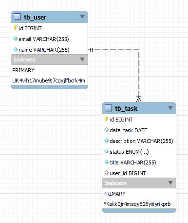

# Task Model Project

This academic project has been developed at SENAI, I'm studying and practicing Java projects.
It aims to create an application to manage tasks using **Java Spring Boot** e **MariaDB**.

## 🛠️ Technologies used
- **Java 17**
- **Spring Boot**
- **MariaDB**
- **JUnit 5**
- **Mockito**
- **H2 Database**

## 📂 Features
- Create, update, list, delete and paginate tasks.
- Organize and manage tasks by status (open, pending, in progress, cancelled and concluded).
- Data persistence with MariaDB.
- Unit testing with JUnit and Mockito
- Environment-based database configurations.

## 🏗️ Project structure

### MER - Entity-Relationship Model


### Relationships
`One-to-Many: One User can have many Tasks.`

### Structure
```
├── src
│   ├── main
│   │   ├── java
│   │   │   └── com
│   │   │       └── senai
│   │   │           ├── task
│   │   │           │   ├── controllers
│   │   │           │   ├── dtos
│   │   │           │   ├── entities
│   │   │           │   ├── repositories
│   │   │           │   ├── services
│   │   │           │   ├── enums
│   │   │           └── user
│   │   │               ├── controllers
│   │   │               ├── dtos
│   │   │               ├── entities
│   │   │               ├── repositories
│   │   │               ├── services
│   │   └── resources
│   │       ├── application.properties
│   │       ├── application-dev.properties
│   │       ├── application-prod.properties
│   ├── test
│   │   ├── java
│   │   │   └── com
│   │   │       └── senai
│   │   │           ├── task
│   │   │           ├── user
```

## ⚙️ Database configuration
Configure the **application.properties** file with your MariaDB credentials:

```properties 
spring.profiles.active=prod
```
```properties
spring.datasource.url=jdbc:mariadb://localhost:3306/taskmodel_db_v1
spring.datasource.username=your_user
spring.datasource.password=your_password
spring.jpa.hibernate.ddl-auto=update
```

## 🚀 How to run the project

1. Clone this repository:
```bash
git clone https://github.com/seu-repositorio/task-model-senai.git
```

2. Navigate to the project diretory:
```bash
cd task-model-senai
```

3. Run the application:
```bash
./mvnw spring-boot:run
```

The application will be available at: [http://localhost:8080](http://localhost:8080)

---

Project developed for educational purposes at SENAI, focusing on hands-on learning of Java Spring Boot and relational databases. 🎓

Let me know if you want me to refine anything or add more details! 🚀

---

## 👩‍💻 Developer author
* Camila Alves: [GitHub](https://github.com/alvescamila87)

